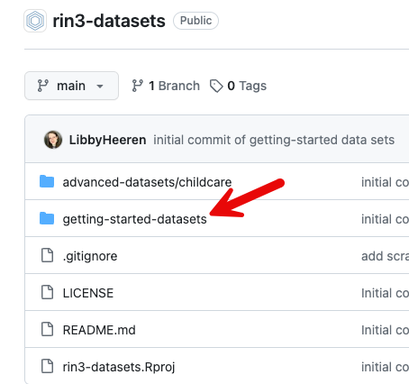
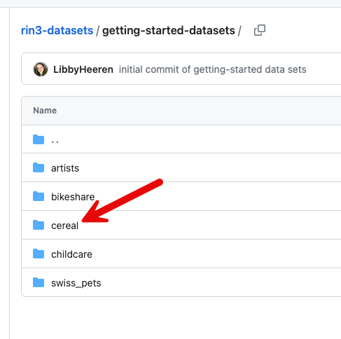
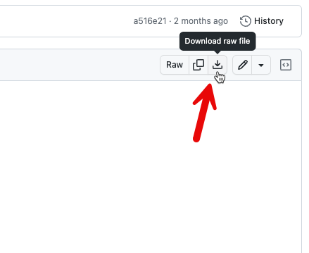
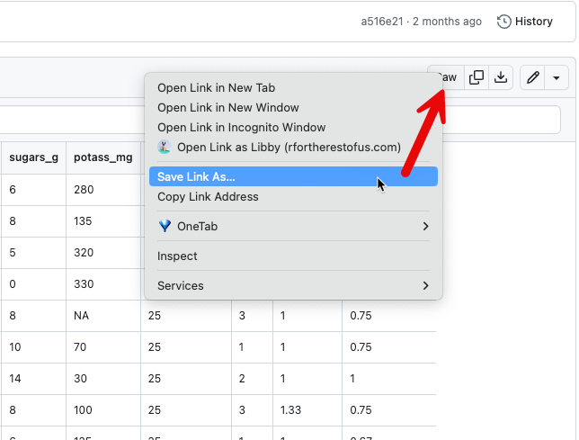
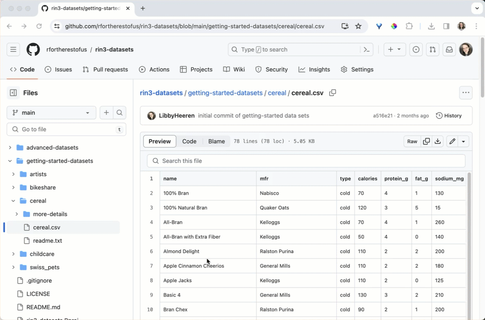

# rin3-datasets

Hello! Are you looking for some data to practice with? You're in the right place.

<br>

In the file structure above, click the folder title "getting-started-datasets".

<br>



There, you'll find folders containing different data sets. Click one of the folder names to open it.

<br>



<br>

Inside, you'll see a data set ending in `.csv`, a readme file (which will display below) containing information about the data set and its variables, and a folder called `more-details`, which will contain the raw data and any scripts we used to clean it.

<br>

In order to use the `.csv` data set in your R project, you can do one of a few things:

1.  You can click the data set name to open it, then click the "download" button if it's available to you to save the csv file. Make sure you navigate to your R project folder and save it there, or move it there after you download it. You can then use it in your code the same way you used the penguins csv file in the first week's lessons.

    <br>

    

2.  You can click the data set name to open it, then right click the "Raw" button at the top right and choose "Save Link As..." to save the csv file. Use this method if you don't see a download button. Make sure you navigate to your R project folder and save it there, or move it there after you download it. You can then use it in your code the same way you used the penguins csv file in the first week's lessons.

    <br>

    

    <br>

3.  You can also click the "Raw" button and then use the URL of the data set file as the file path argument in `read_csv()`.

    <br>  <br>

    For example, if you were wanting to import the cereal data set, you could run this, notice that the URL contains both the https header and the word "raw" is in the URL as well:

    ```{r}
    cereal_data <- read_csv("https://raw.githubusercontent.com/rfortherestofus/rin3-datasets/main/getting-started-datasets/cereal/cereal.csv")
    ```
